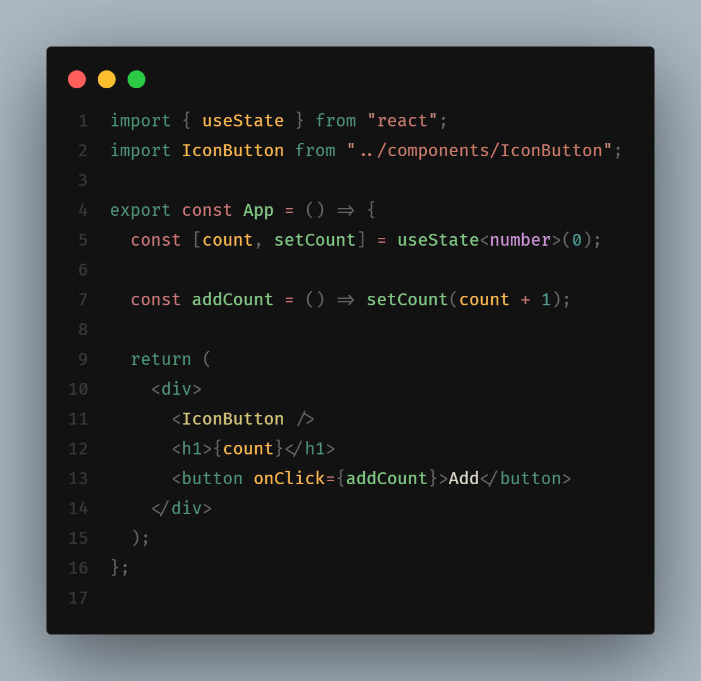

<h1 align="center">Curry Theme for VS Code</h1>

<p align="center">

</p>

## Match with System

<!--eslint-skip-->

```jsonc
// .vscode/setting.json
{
  "workbench.preferredDarkColorTheme": "Curry Dark",
}
```