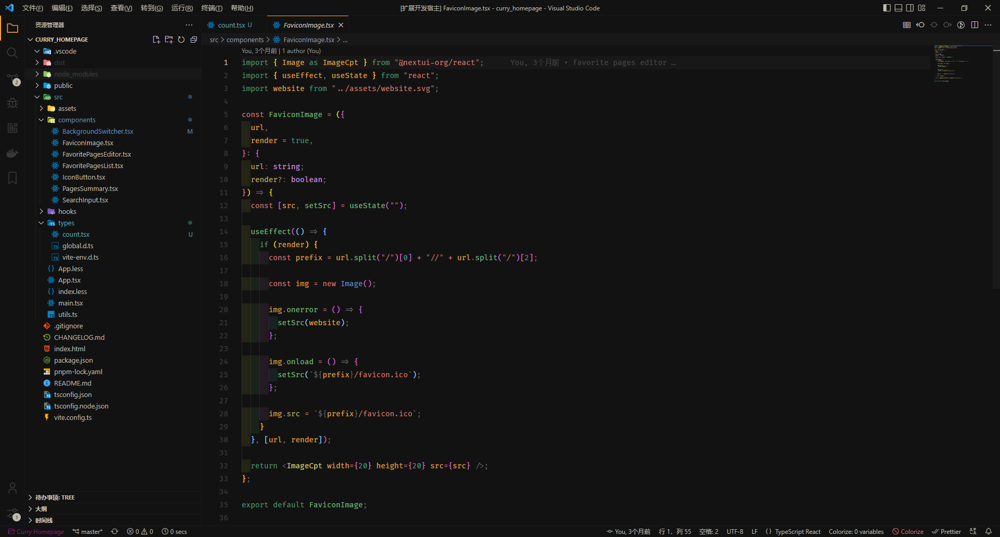

<h1 align="center">Curry Theme for VS Code</h1>

<p align="center">
<a href="https://marketplace.visualstudio.com/items?itemName=CoderCurry.curry-theme" target="__blank">
</a>
</p>

<p align="center">

</p>

## Match with System

<!--eslint-skip-->

```jsonc
// .vscode/setting.json
{
  "workbench.preferredDarkColorTheme": "Curry Dark",
}
```

## Thanks

This project is inspired by [vscode-theme-vitesse](https://github.com/antfu/vscode-theme-vitesse)

## License

Copyright (c) 2022 coder_curry
